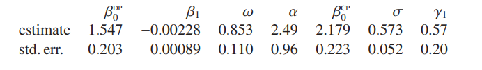

```{r setup, include=FALSE}
knitr::opts_chunk$set(echo = T)
library(tidyverse)
library(gridExtra)
library(CircStats)
library(sn)
```
\newpage

# Introducción

Las variables aleatorias son elementos fundamentales en la estadística y en muchas ocasiones posterior al estudio de su comportamiento se adaptan muy bien a funciones de probabilidad ya conocidas o en su defecto se empieza a construir nuevas funciones de probabilidad con sus correspondientes parámetros.

En el contexto actual existe bastante teoría consolidada sobre el modelo de distribución Normal y su implicancia en la teoría de la probabilidad, inferencia estadística (clásica y bayesiana), y así también en modelos de regresión, series de tiempo y otros. Mencionar también que muchas familias de funciones de probabilidad se aproximan a la Normal a medida que un determinado parámetro tiene a un valor apropiado.

Es así que [@azzalini1985] define la función de densidad Skew-Normal, propiedades y estadísticos principales, generando posteriormente bastantes investigaciones y artículos referente a esta distribución. En el prefacio del libro [@azzalini2013], menciona que la construcción de esta teoría que parte de una función de densidad simétrica y mediante modificaciones adecuadas de la misma conduce a generar un conjunto de distribuciones no simétricas, donde el objetivo es estudiar familias paramétricas flexibles de distribuciones continuas, permitir una posible desviación de la simetría las cuales generen familias de distribuciones más flexibles y realistas.

En el presente documento se mostrará por un lado la formulación del modelo Normal, luego su modificación de parámetros para generar el modelo asimétrica Skew-Normal [@azzalini1985] y su teoría en modelos de regresión lineal con errores Skew-normal, y para finalizar aplicaciones de este modelo de regresión.

# Marco Teórico

## Modelo Normal

El modelo normal es una de las más importantes y conocidos distribuciones de probabilidad continua en el campo estadístico.

### Definición

Sea $X$ una variable aleatoria con distribución normal con media $\mu$ y varianza $\sigma^2$, que se denota como $X\sim N(\mu,\sigma^2)$, con función de densidad dada por:

\begin{equation}\label{f_normal}
f(x)=(2\pi\sigma^2)^{-\frac{1}{2}}exp\{-\frac{1}{2\sigma^2}(x-\mu)^2 \}\hspace{1cm}, \forall x\in\mathbb{R} 
\end{equation}

donde los parámetros: $-\infty<\mu<\infty$ y $\sigma^2>0$.


### Función generadora de momentos

Sea $X$ una variable aleatoria con distribución $N(\mu,\sigma^2)$, entonces la función generadora de momentos es:

\begin{equation}\label{momento_normal}
M_X(t)=\mathbb{E}(e^{tx})=exp(\mu t+\frac{1}{2}\sigma^2 t^2)
\end{equation}

### Distribución normal estandar

La distribución normal con $\mu=0$ y $\sigma^2=1$ se denomina como la distribución normal estándar. Así la función de densidad es:

\begin{equation}\label{f_normal_est}
\varphi(z)=(2\pi)^{-\frac{1}{2}}exp\{-\frac{z^2}{2}\}\hspace{1cm}, \forall z\in\mathbb{R}
\end{equation}

y la función de distribución será:

\begin{equation}\label{facum_normal_est}
\Phi(z)=\mathbb{P}(Z<z)=\int_{-\infty}^z \varphi(u)du\hspace{1cm}, \forall z\in\mathbb{R}
\end{equation}

**Observación.** Hacer notar que cuando la tenemos una v.a. $X\sim N(\mu,\sigma^2)$, entonces $Z$ es una variable aleatoria estandarizada $Z=\frac{X-\mu}{\sigma}$ donde $Z\sim N(0,1)$.

## Modelo Skew-Normal

En principio para desarrollar el modelo Skew-Normal se debe tener en cuenta la siguiente proposición.

**Proposición 1.** Sea $f_0$ una función de densidad de probabilidad en $\mathbb{R}^d$, sea $G_0(\cdot)$ una función de distribución continua en la recta real y sea $w(\cdot)$ una función de valor real en $\mathbb{R}^d$, tal que:

$$f_0(-x)=f_0(x),\hspace{1cm}w(-x)=-w(x),\hspace{1cm}G_0(-y)=1-G_0(y)$$ para todo $x\in\mathbb{R}^d, \;y\in\mathbb{R}$. Entonces

\begin{equation}\label{prop1} 
f(x)=2f_0(x)G_0\{w(x)\}
\end{equation}

es una función de densidad en $\mathbb{R}^d$.

### Definición

Si por (\ref{prop1}) se selecciona a $f_0=\varphi$ y $G_0=\Phi$ que representan la función de densidad (\ref{f_normal_est}) y la función de distribución (\ref{facum_normal_est}) respectivamente de la $N(0,1)$ y $w(x)=\alpha x$, para algún valor real $\alpha$, produce la función de densidad de la distribución Skew-Normal básica:

\begin{equation}\label{f_sn01}
\varphi(x;\alpha)=2\varphi(x)\Phi(\alpha x)\hspace{1cm}(-\infty<x<\infty)
\end{equation}

Ahora se introducirá un parámetro de escala $\omega$ y otro de localización $\xi$. Si $Z$ es una variable aleatoria continua con función de densidad (\ref{f_sn01}), entonces la variable $Y$ queda expresada como:

\begin{equation}\label{sn}
Y=\xi+\omega Z\hspace{1cm} (\xi\in\mathbb{R},\omega\in \mathbb{R}^+)
\end{equation}

Así, $Y$ es llamada variable Skew-Normal(SN) con parámetro de localización $\xi$, parámetro de escala $\omega$ y parámetro de inclinación $\alpha$. La función de densidad en $x\in \mathbb{R}$ de la forma (\ref{f_sn01}) es:

\begin{equation}\label{f_sn}
\frac{1}{\omega}\varphi\left(\frac{x-\xi}{\omega};\alpha\right)
\equiv\frac{2}{\omega}\varphi \left(\frac{x-\xi}{\omega}\right)\Phi\left(\alpha\frac{x-\xi}{\omega}\right)
\end{equation}

y se escribe: $$Y\sim SN(\xi,\omega^2,\alpha)$$

donde el cuadrado de $\omega$ por analogía corresponde a la notación de $N(\mu,\sigma^2)$.

*Observación.* Cuando $\xi=0$ y $\omega=1$ se vuelve a la definición básica de la Skew-Normal (\ref{f_sn01}).

**Proposición 2.** Si $Z$ denota una variable aleatoria $SN(0,1,\alpha)$, con función de densidad $\varphi(x;\alpha)$, se cumplen las siguiente propiedades:

a) $\varphi(x;0)=\varphi(x),\;\;\forall x$  
b) $\varphi(0;\alpha)=\varphi(0),\;\;\forall \alpha$  
c) $-Z\sim SN(0,1,-\alpha)$, entonces $\varphi(-x;\alpha)=\varphi(x;-\alpha),\;\;\forall x$  
d) $lim_{\alpha\to\infty} \varphi(x;\alpha)=2\varphi(x)I_{[0,\infty)}(x),\;\;\forall x$  
e) $Z^2\sim\chi^2_1$ independientemente de $\alpha$  
f) Si $Z'\sim SN(0,1,\alpha')$ con $\alpha'<\alpha$, entonces $Z'<_{st}Z$  

### Función generadora de momentos

La función generadora de momentos de $Y$ es obtenida por:

\begin{align}\nonumber
M_Y(t)&=\mathbb{E}(e^{yt})=\mathbb{E}(exp\{(\xi+wz)t\})\\
      &=2 exp\{\xi t+\frac{1}{2}\omega^2 t^2\}\int_{-\infty}^{\infty}\varphi(z-\omega t)\Phi(\alpha z)dz \\\nonumber
      &=2 exp\{\xi t+\frac{1}{2}\omega^2 t^2\} \Phi(\delta \omega t)
\end{align}

donde $\delta=\delta(\alpha)=\frac{\alpha}{\sqrt{1+\alpha^2}}$

Luego se utiliza la función generadora cumulante:

\begin{equation}\label{f_cumulante}
K_Y(t)=log\;M_Y(t)=\xi t+\frac{1}{2}\omega^2 t^2+\zeta_0(\delta\omega t)
\end{equation}

donde 
\begin{equation}\label{zeta0}
\zeta_0(x)=log\{2\Phi(x)\}
\end{equation}

y sus derivada $\zeta_r(x)=\frac{d^r}{dx^r}\zeta_0(x)$ con $r=1,2,...$

así, se tiene:

\begin{align}\nonumber
\zeta_1(x)&=\frac{d}{dx}\zeta_0(x)=\frac{\varphi(x)}{\Phi(x)}\\\nonumber
\zeta_2(x)&=\frac{d^2}{dx^2}\zeta_0(x)=\frac{d}{dx}\zeta_1(x)\\\nonumber
          &=\frac{\varphi'(x)\Phi(x)-\varphi(x)^2}{\Phi(x)^2}
           =\frac{-x\varphi(x)}{\Phi(x)}-\frac{\varphi(x)^2}{\Phi(x)^2}
           =-x\zeta_1(x)-\zeta_1(x)^2\\\nonumber
\zeta_3(x)&=\frac{d^3}{dx^3}\zeta_0(x)=\frac{d}{dx}\zeta_2(x)\\\nonumber
          &=-\zeta_1(x)-x\zeta_1(x)'-2\zeta_1(x)'\zeta_1(x)\\\nonumber
          &=-\zeta_1(x)-x[-x\zeta_1(x)-\zeta_1(x)^2]-2[-x\zeta_1(x)-\zeta_1(x)^2]\zeta_1(x)\\\nonumber
          &=-\zeta_1(x)+x^2\zeta_1(x)+x\zeta_1(x)^2+2x\zeta_1(x)^2+2\zeta_1(x)^3\\\nonumber
          &=2\zeta_1(x)^3+3x\zeta_1(x)^2+x^2\zeta_1(x)-\zeta_1(x)\\\nonumber
\zeta_4(x)&=\frac{d^4}{dx^4}\zeta_0(x)=\frac{d}{dx}\zeta_3(x)\\\nonumber
          &=-6\zeta_1(x)^2\zeta_1(x)'+3[\zeta_1(x)^2+2x\zeta_1(x)\zeta_1(x)']+[2x\zeta_1(x)+x^2\zeta_1(x)']-\zeta_1(x)'\\\nonumber
          &=-6\zeta_1(x)^2[-x\zeta_1(x)-\zeta_1(x)^2]+3\{\zeta_1(x)^2+2x\zeta_1(x)[-x\zeta_1(x)-\zeta_1(x)^2]\}+\\\nonumber
          &\hspace{2cm}\{2x\zeta_1(x)+x^2[-x\zeta_1(x)-\zeta_1(x)^2]\}-[-x\zeta_1(x)-\zeta_1(x)^2]\\\nonumber
          &=-6x\zeta_1(x)^3-6\zeta_1(x)^4+3\zeta_1(x)^2-6x^2\zeta_1(x)^2-6x\zeta_1(x)^3+2x\zeta_1(x)-x^3\zeta_1(x)-x^2\zeta_1(x)^2+x\zeta_1(x)+\zeta_1(x)^2\\\label{momentos_sn}
          &=-6\zeta_1(x)^4-12x\zeta_1(x)^3-7x^2\zeta_1(x)^2+4\zeta_1(x)^2-x^3\zeta_1(x)+3x\zeta_1(x)
\end{align}

Para todo $\zeta_r(x)$ con $r>1$ pueden escribirse como funciones de $\zeta_1(x)$ y pontencias de $x$. Notar que $\zeta_1(x)>0$, $x+\zeta_1(x)>0$ y $\zeta_2(x)<0$.

Utilizando (\ref{f_cumulante}), las derivadas de $K_Y(t)$ hasta el cuarto orden son:

\begin{align}
\mathbb{E}\{Y\}&=\xi+\omega \mu_z\\
Var\{Y\}&=(\omega\sigma^2_z)^2\\
\mathbb{E}\{(Y-\mathbb{E}(Y))^3\}&=\frac{1}{2}(4-\pi)(\omega \mu_z)^3\\
\mathbb{E}\{(Y-\mathbb{E}(Y))^4\}&=2(\pi-3)(\omega \mu_z)^4
\end{align}

Donde $\mu_z=\mathbb{E}(Z)=b\delta$, $\sigma^2_z=Var(Z)=1-\mu^2_z=1-b^2\delta^2$ y $b=\zeta_1(0)=\sqrt(\frac{2}{\pi})$


### Asimetría

Para la asimetría estandarizando se tiene:

$$\gamma_1\{Y\}=\gamma_1\{Z\}=\frac{\mathbb{E}\{(Y-\mathbb{E}(Y))^3\}}{\omega^3\sigma_z^3}=\frac{4-\pi}{2}\frac{\mu_z^3}{\sigma_z^3}$$


### Kurtosis


Para la Kurtosis estandarizando se tiene:

$$\gamma_2\{Y\}=\gamma_2\{Z\}=\frac{\mathbb{E}\{(Y-\mathbb{E}(Y))^4\}}{\omega^4\sigma_z^4}=2(\pi-3)\frac{\mu_z^4}{\sigma_z^4}$$

### Función log-verosimilitud

Si $y$ solo un valor muestreado de una variable aleatoria $Y\sim SN(\xi,\omega^2,\alpha)$ su función log-verosimilitud es:

\begin{equation}\label{verosimilitud}
\ell_1(\theta^{DP};y)=ctte-log \omega - \frac{(y-\xi)^2}{2\omega^2}+\zeta_0\left(\alpha\frac{y-\xi}{\omega}\right)
\end{equation}

donde $\theta^{DP}=(\xi,\omega,\alpha)^t$ y $\zeta_0(\cdot)$ esta definida como (\ref{zeta0}). El superindice $DP$ significa *parametros directos (direct parameters)*.

Si $z=\left(\frac{y-\xi}{\omega}\right)$ y $\zeta_1(\cdot)$ es definida como (\ref{momentos_sn}) el componente del vector SCORE son:

\begin{align}\label{score}\nonumber
\frac{\partial \ell_1}{\partial \xi}&=\frac{z}{\omega}-\frac{\alpha}{\omega}\zeta_1(\alpha z)\\\nonumber
\frac{\partial \ell_1}{\partial \omega}&=
-\frac{1}{\omega}+\frac{z^2}{\omega}-\frac{\alpha}{\omega}\zeta_1(\alpha z)z\\
\frac{\partial \ell_1}{\partial \alpha}&=\zeta_1(\alpha z)z
\end{align}

Si tenemos una muestra aleatoria $y_1,..., y_n$ de $Y \sim SN(\xi,\omega^2, \alpha)$, el log de verosimilitud es $\ell(\theta)^{DP}$ se obtiene mediante la suma de $n$ términos del tipo (\ref{verosimilitud}) y la correspondiente suma de términos (\ref{score}) conduce a las ecuaciones de verosimilitud.

\begin{align}\label{sol_verosimilitud}\nonumber
\sum_i z_i-\alpha\sum_i\zeta_1(\alpha z_i)&=0\\\nonumber
\sum_i z_i^2-\alpha\sum_i z_i\zeta_1(\alpha z_i)&=n\\\nonumber
\sum_i z_i\zeta_1(\alpha z_i)=0\\
\end{align}

Donde $z_i=\frac{y_i-\xi}{\omega}$, para $i=1,...,n$. La presencia de la función no lineal $\zeta_1$ impide la solución de estas ecuaciones, por lo que se emplea métodos numéricos. De la tercera ecuación, la segunda requiere que $\xi$ y $\omega$ satisfagan:

$$\hat\omega^2=\frac{1}{n}\sum_i (y_i-\hat\xi)^2$$

que produce un hecho conocido para las variables normales.

*Observación.* Cuando $\alpha=0$ se reduce a la función de log-verosimilitud de la distribución normal alcanza su máximo cuando $\xi=\bar{y}$ media muestral y $\omega=s$ desviación estándar muestral no corregida, donde:

$$\bar{y}=\frac{1}{n}\sum_{i=1}^{n}y_i \;,\hspace{1cm} s=\left(\frac{1}{n}\sum_{i=1}^{n}(y_i-\bar{y})^2\right)^{-1/2}$$
Además, el punto $\theta^{DP}=(\bar{y}, s, 0)^t$ es también una solución de la tercera ecuación (\ref{sol_verosimilitud}), y por tanto es un punto estacionario de $\ell(\theta^{DP})$, para cualquier muestra.

Si $\hat\xi(\alpha)$ y $\hat\omega(\alpha)$ denotan la estimación de máxima verosimilitud (MLE) de $xi$ y $\omega$, para cualquier valor fijo de $\alpha$ la función de log-verosimilitud del perfil es:

$$\ell^*(\alpha)=\ell(\hat\theta^{DP}(\alpha))$$

donde $\hat\theta^{DP}(\alpha)=(\hat\xi(\alpha),\hat\omega(\alpha),\alpha)^t$ que se deriva de las ecuaciones anteriores y son eficientes para el SCORE de $\ell^*(\alpha)$, cuyas derivadas son:

$$\frac{d\ell^*(\alpha)}{d\alpha}=\frac{\partial\ell(\theta^{DP})}{\partial \xi}\frac{d\hat\xi(\alpha)}{d\alpha}+\frac{\partial\ell(\theta^{DP})}{\partial \omega}\frac{d\hat\omega(\alpha)}{d\alpha}+\frac{\partial\ell(\theta^{DP})}{\partial\alpha}$$

donde las derivadas parciales se evalúan en $\theta^{DP}=\hat\theta^{DP}(\alpha)$. A partir de (\ref{score}), estas derivadas parciales desaparecen en $\hat\theta^{DP}(0)=(\bar{y}, s, 0)^t$, y se deduce que $\ell^*(\alpha)$ siempre tiene un punto estacionario en $\alpha = 0$. Lo que implica que la prueba de Score para la $H_0:\alpha=0$ no es válida al menos en su forma estándar.


# Modelo de regresión lineal Skew Normal

Para el parámetro de localización $\xi$, que se expresa como una combinación lineal de un conjunto $p$-dimensional de covariables $x$, así,

$$\xi=x^t\beta, \hspace{1cm}\beta\in\mathbb{R}^p$$
Entonces se tiene el modelo de regresión lineal dado por:

$$Y_i=x_i^t\beta+\varepsilon_i,\hspace{1cm}i=1,...,n$$

con $\varepsilon_i\sim^{iid} SN(0,\omega^2,\alpha)$, $\beta$ un vector de parámetros desconocidos. 

## Supuestos

Para este modelo se tiene los siguientes supuestos:

- Sea una muestra aleatoria independiente de $y=(y_1,...,y_n)^t$ con $n>p$.

- Matriz de diseño $X=(x_1,...,x_n)^t$ de dimensión $n\times p$ de rango $p$, donde la primera columna de $X$ es el vector $1_n$ (Multicolinealidad).

- Los residuos deben tener distribución Skew-Normal.

- Los residuos son independientes.

- Los residuos son homocedasticos.


## Estimación del modelo

En este caso, la expresión de la función del vector SCORE, será:

\begin{equation}\label{log_beta}
\frac{\partial \ell_1}{\partial\xi}=\left(\frac{z}{\omega}-\frac{\alpha}{\omega}\zeta_1(\alpha z)\right)x\end{equation}

Luego se tiene que del estimador:

$$\hat{\omega}^2=\frac{1}{n}\sum_{i} (y_i-\hat{\xi_i})^2;\hspace{1cm}\hat{\xi_i}=x_i^t\hat\beta;\;\; i=1,...,n$$

Cuando $\alpha=0$, la suma de términos de (\ref{log_beta}) conduce a $\sum_{i}z_ix_i=0$, las ecuaciones son las del modelos lineal clásico.

Por lo tanto un punto estacionario de la log-verosimilitud se produce en $\hat\theta^{DP}= (\bar{\beta}^t, s, 0)^t$, donde $\bar{\beta}=(X^tX)^{-1}X^t y$ es la estimación por mínimos cuadrados y en este caso $s$ viene dado porla desviación estándar no corregida de los residuos por mínimos cuadrados $y-x\bar\beta$.

### Información de Fisher para Parámetros directos DP

Si se tiene un conjunto de $n$ observaciones $y = (y_1,..., y_n)^t$, independientes. Las contribuciones de una sola observación a las funciones SCORE del parámetro directo $\theta^{DP}=(\beta^t,\omega,\alpha)^t$ vienen dadas por (\ref{log_beta}) y las dos últimas expresiones de (\ref{score}), respectivamente. Diferenciando la función SCORE con las sumatorias con $n$ observaciones, se tiene:

$$-\frac{\partial^2\ell}{\partial\beta\partial\beta^t}=\omega^{-2}X^t(I_n+\alpha^2 Z_2 )X$$

$$-\frac{\partial^2\ell}{\partial\beta\partial\omega}=\omega^{-2}X^t(2z-\alpha \zeta_1(\alpha z)+\alpha^2 Z_2 z)$$

$$-\frac{\partial^2\ell}{\partial\beta\partial\alpha}=\omega^{-1}X^t(\alpha \zeta_1(\alpha z)-\alpha Z_2 z)$$

$$-\frac{\partial^2\ell}{\partial\omega^2}=\omega^{-2}(-n+3(1_n^t z^2)-2\alpha \zeta_1(\alpha z)^t z+\alpha^2 \zeta_2(\alpha z)^t z^2)$$

$$-\frac{\partial^2\ell}{\partial\omega \partial\alpha}=\omega^{-1}(\zeta_1(\alpha z)^t z+\alpha \zeta_2(\alpha z)^t z^2)$$

$$-\frac{\partial^2\ell}{\partial\alpha^2}=\zeta_2(\alpha z)^t z^2$$
donde $z=\frac{y-X\beta}{\omega}$, $Z_2=diag(-\zeta_2(\alpha z))>0$

Al aplicar media a las segundas derivadas de la log-verosimilitud, se pueden determinar de manera simple los siguientes términos:

$$\mathbb{E}\{(Z^k \zeta_1(\alpha Z))\}=\frac{b}{(1+\alpha^2)^{(k+1)/2}}\mathbb{E}(U^k)$$

Por un lado se tiene que:

$$\mathbb{E}\{(Z^k \zeta_1(\alpha Z))\}=\frac{b}{(1+\alpha^2)^{(k+1)/2}}(1\times 3\times...\times(k-1)); \;k=0,2,4,...$$

y por otro:

$$\mathbb{E}\{(Z^k \zeta_1(\alpha Z))\}=\frac{b}{(1+\alpha^2)^{(k+1)/2}}0 ;\;k=1,3,5,...$$

donde $U\sim N(0,1)$ y $b=\sqrt{2/\pi}$

Este término no es fácil de resolver:

$$a_k=a_k(\alpha)=\mathbb{E}\{Z^k \zeta_1(\alpha Z)^2\}, \;\;k=0,1,...$$

que se debe calcular numéricamente para $k=0,1,2$. Con estos elementos y recordando que $\zeta_2(u)=-\zeta_1(u)\{u+\zeta_1(u)\}$ la matriz de información de Fisher es:

$$\mathcal{I}^{DP}(\theta^{DP}) =\begin{pmatrix}
 \frac{1+\alpha^2 a_0}{\omega^2}X^t X  &\cdot &\cdot\\
  \frac{1}{\omega}\left( \frac{b \alpha(1+2\alpha^2)}{(1+\alpha^2)^{3/2}}+\alpha^2 a_1 \right)1_n^tX & n\frac{2+\alpha^2a_2}{\omega^2} & \cdot\\ 
  \frac{1}{\omega}\left( \frac{b }{(1+\alpha^2)^{3/2}}-\alpha a_1 \right)1_n^tX & -n\frac{\alpha a_2}{\omega} & n a_2
\end{pmatrix}$$

que es una matriz simétrica.

cuando $\alpha = 0$, consideremos este caso con más detenimiento. La matriz de información esperada esperada se reduce entonces a

$$\mathcal{I}^{DP}((\beta^t,\omega,0)^t) =
\begin{pmatrix}
 \frac{1}{\omega^2}X^t X  &\cdot &\cdot\\
  0 & \frac{2n}{\omega^2} & \cdot\\ 
  \frac{1}{\omega}b 1_n^tX & 0 & b^2n
\end{pmatrix}$$

con determinante

$$\frac{2nb^2}{\omega^{2(p+1)}}det(X^tX)[n-1_n^t X(X^tX)^{-1}X^t 1_n]$$

Será igual a $0$, si el $1_n$ pertenece al espacio de columnas de $X$.

Cuando $\alpha = 0$, la singularidad de la información esperada impide las aplicaciones de la teoría asintótica estándar de $MLE$. Aunque este comportamiento anómalo se limita al valor específico $\alpha = 0$, que corresponde al subconjunto de distribuciones normales. Por ejemplo, un problema natural a considerar es probar la hipótesis nula de que $\alpha = 0$, pero la metodología estándar no se aplica dada la singularidad anterior.

La singularidad de la matriz de información esperada de $\tilde\theta^{DP}=(\tilde\beta^t, s, 0)^t$ es siempre una solución de las ecuaciones de verosimilitud. Evaluando de la segunda derivada se tiene:

$$-\frac{\partial^2\ell}{\partial\theta^{DP}\partial(\theta^{DP}t)} |_{\theta^{DP}=\tilde\theta^{DP}}=
\begin{pmatrix}
 \frac{1}{s^2}X^t X  &\cdot &\cdot\\
  0 & \frac{2n}{s^2} & \cdot\\ 
  \frac{1}{s}b 1_n^tX & 0 & b^2n
\end{pmatrix}$$

que también es singular.

### Parametrización Centrada

Para resolver el problema presentado anteriormente, se introduce una reparametrización destinada a eliminar el problema de la singularidad cuando $\alpha=0$, la cual es:

$$Y=\mu+\sigma Z_0,\hspace{1cm} Z_0=\frac{Z-\mu_z}{\sigma_z}\sim SN\left(-\frac{\mu_z}{\sigma_z}, \frac{1}{\sigma_z^2},\alpha\right)$$

donde 

* $\sigma^2=Var(Y)=(\omega \sigma_z)^2$

* $\mu_z=\mathbb{E}(Z)=b\delta$

* $\sigma_z^2=Var(Z)=1-b^2\delta^2$

* $b=\sqrt{2/\pi}$

* $\delta=\frac{\alpha}{\sqrt{1+\alpha^2}}$.

Ahora se considera un nuevo vector de parámetros $\theta^{CP}=(\mu, \sigma, \gamma_1)^t$, donde CP quiere decir *parámetros centrados (centred parameters)*, donde

$$\mu=\xi+b\omega\frac{\alpha}{\sqrt{1+\alpha^2}}=\xi+b\omega\delta(\alpha)$$
$$\sigma=\omega(1-b^2 \delta(\alpha)^2)^{1/2}$$

$$\gamma_1=\frac{4-\pi}{2}\frac{b^3\delta(\alpha)^3}{[1-b^2\delta(\alpha)^2]^{3/2}}=\frac{4-\pi}{2}\frac{b^3\alpha^3}{[1+(1-b^2)\alpha^2]^{3/2}}$$

$\omega=\frac{\delta}{(1-b^2\delta(\alpha)^2)^{1/2}}$ y $\xi=\mu-b\omega\delta(\alpha)$

Una ventaja importante de la parametrización centrada, es que $\mu$ es un parámetro de localización mucho más familiar, normalmente con una interpretación matemática más clara que $\xi$. Por razones similares, $\sigma$ y $\gamma_1$ serían a $\omega$ y $\alpha$, respectivamente.

Entonces la formulación $CP$ se establece como $\theta^{CP}=(\beta^{CP},\sigma,\gamma_1)$
Ahora para los parámetros se cumple $\beta^{CP}=\beta^{DP}$, excepto el primer parámetro intercepto $\beta_0$, de forma que:

$$\beta_0^{CP}=\beta_0^{DP}+\omega\mu_z$$
que coincide con $\mathbb{E}(Y)=\xi+\omega\mu_z$.

Luego las matrices de información esperada y observada para $CP$ se obtienen a partir de:

$$\mathcal{I}^{CP}(\theta^{CP})=D^t\mathcal{I}^{DP}(\theta^{DP})D,\;\; \mathcal{I}^{CP}(\hat\theta^{CP})=\hat{D}^t\mathcal{I}^{DP}(\hat\theta^{DP})\hat{D}$$

donde $D$ denota la matriz Jacobiana:

$$D=D_{rs}=(\frac{\partial\theta_r^{DP}}{\partial\theta_s^{CP}})=
\begin{pmatrix}
1 & 0 & -\frac{\mu_z}{\sigma_z} & \frac{\partial\xi}{\partial \gamma_1}\\
0 & I_{p-1} & 0 & 0 \\
0 & 0 & \frac{1}{\sigma_z} & \frac{\partial\omega}{\partial \gamma_1}\\
0 & 0 & 0 & \frac{d\alpha}{d\gamma_1}
\end{pmatrix}$$

y $\hat{D}$ denota a $D$ evaluado en el punto de MLE. 

### Distribución asintótica de MLE

Se ha visto que la matriz de información cuando $\alpha=0$ es singular, lo que viola una de las condiciones estándar para la normalidad asintótica de la MLE. Este tipo de situación cae bajo el paraguas de la teoría asintótica no estándar desarrollada por (Rotnitzky et al., 2000).

Es así que el $CP$ se comporta regularmente en el punto $\gamma_1 = 0$, de dos maneras: 

(a) el perfil log-verosimilitud de $\gamma_1$ no tiene ningún punto estacionario en $\gamma_1 = 0$

(b) si $\theta^{CP}=(\mu,\sigma,0)$, entonces

$$\sqrt{n}(\hat\theta^{CP}-\theta^{CP})\xrightarrow{d}N_3\left(0,diag(\sigma^2,\frac{1}{2}\sigma^2,6)\right)$$

## Análisis de Residuos normalizados

Los residuos de la regresión estan dados por:

$$\hat z_i=\frac{(y_i-\hat\xi)}{\hat\omega};\hspace{1cm}i=1,...,n$$

tal que $z_i$ debe ser muestreada aproximadamente como una distribución $\chi^2_1$, recordando que:

$$Z^2=\frac{(Y-\xi)^2}{\omega^2}\sim \chi^2_1$$


## Prueba de hipótesis e Intervalos de confianza

Recordemos que, en un problema de estimación regular de $k$ parámetros, el conjunto de valores de los parámetros que tienen una deviance no mayor al cuantil $p-ésimo$ de la distribución $\chi^2_k$ delimitan una región de confianza con un nivel de confianza $p$. En consecuencia, la deviance puede utilizarse para la prueba de hipótesis donde se evaluará si un punto nominado pertenece a la región de confianza. En el presente escenario, la no regularidad de la deviance antes mencionada afecta a la construcción de conjuntos de confianza, que en el presente caso con $k = 1$ suelen corresponder a intervalos. 

El parámetro $\alpha = 0$ se produce cuando $D(\alpha)$ es bastante grande, por lo tanto es una región que no interfiere efectivamente en la construcción de intervalos de confianza y pruebas de hipótesis, al menos para los niveles de confianza habitualmente considerados. Sin embargo, es evidente que el problema sigue existiendo para otros conjuntos de datos con $\hat\alpha$ más cercanos a $0$, para los que $D(0)$ no será tan grande.

En general la función de log-verosimilitud asociada a las variables de la $SN$ es algo inusual.

## Modelo ajustado

Pot lo visto anteriormente se tiene el modelo de regresión lineal estimado y ajustado tomando en cuenta los parámetros $CP$ y esta dado por:

$$\hat{Y_i}=x_i^t\hat{\beta}+\frac{b\delta}{\sqrt{1-b^2\delta^2}},\hspace{1cm}i=1,...,n$$

con $\varepsilon_i\sim^{iid} SN(0,\sigma^2,\gamma_1)$ $iid$, $\beta$ 

# Aplicación 

Para poder mostrar de manera práctica lo visto en secciones anteriores se realizará algunas simulaciones con el software R de las distribuciones [@ppt] y así también un modelo de regresión lineal para errores skew-normal, con la librería `sn` que muestra bastantes aplicaciones [@paquetesn].

## Datos e información

Se utiliza la base de datos que esta en R `data(wines)` que hace referencia a tres cultivos (Barolo, Barbera y Grignolino) de la región de Piedmont de Italia, que contiene $178$ diferentes vinos italianos con $59$, $48$ y $71$ datos respectivamente y se recogieron $28$ medidas químicas de cada clase de vino.


## Regresión lineal

### Datos 1

Para este primer paso de la modelación solo se trabajará con el cultivo Barolo y la variable fenoles (phenols) que será nuestra variable de respuesta y se pondrá como covariable a la constante $1$ esto con el cometido de visualizar el comportamiento de la $Y$.

```{r fig.height=3}
data(wines)
barolo_phenols <- wines[wines$wine=="Barolo", "phenols"]
hist(barolo_phenols,main="Fenoles del cultivo Barolo")
```

Se modelará en primera instancia con un modelo de regresión clásico y luego con un modelo de regresión Skew-Normal con tipo de parametrización $DP$.

```{r }
fit <- lm(barolo_phenols ~ 1)
fit_sn <- selm(barolo_phenols ~ 1, family="SN")

summary(fit)
summary(fit_sn,param.type="DP")
```

Ahora vemos el comportamiento que tiene sus residuos al cuadrado con el qq-plot.

```{r fig.height=3}
res<-(barolo_phenols-fit$fitted.values)/0.339

xi<-coef(fit_sn,param.type="DP")[1]
omega<-coef(fit_sn,param.type="DP")[2]
res_sn<-(barolo_phenols-xi)/omega
p<-(1:59)/60

par(mfrow=c(1,2))
qqplot(qchisq(p,1),res^2,ylim = c(0,10),main = "QQ-Plot residuos Normales")
qqline(res_sn^2,distribution = function(p) qchisq(p, df = 1),probs = c(0.215, 0.5), col = 2)
qqplot(qchisq(p,1),res_sn^2,ylim = c(0,10),main = "QQ-Plot residuos SN")
qqline(res_sn^2,distribution = function(p) qchisq(p, df = 1),probs = c(0.215, 0.5), col = 2)
```

y sus respectivos histogramas.

```{r fig.height=3}
par(mfrow=c(1,2))
hist(res,main = "Residuos Normales")
hist(res_sn ,main = "Residuos SN")
```


```{r eval=FALSE, include=FALSE}
pll <- profile(fit_sn, "cp", param.name="gamma1", param.val=c(0, 0.97))
profile(fit_sn, "dp", param.name=c("omega", "alpha"),param.val=list(c(0.25, 1), c(-1, 9)),npt=c(51,51) )
```

### Datos 2

Para este segundo caso se trabajará con el cultivo Grifnolino y la variable proantocianinas (proanthocyanins) que será nuestra variable de respuesta y se pondrá como covariable a la variable nitrogeno (nitrogen) esto con el cometido de visualizar el comportamiento de la $Y$.

```{r}
vinos<-tibble(cultivo=wines$wine,nitrogeno=wines$nitrogen,proantocianinas=wines$proanthocyanins)
vinos<-vinos %>% filter(vinos=="Grignolino")
mod<-lm(proantocianinas~nitrogeno,data = vinos)
mod_sn<-selm(proantocianinas~nitrogeno,data = vinos,family = "SN")

summary(mod)
summary(mod_sn,param.type="DP")
summary(mod_sn,param.type="CP")
```

```{r}
omega_dp<-coef(mod_sn,param.type="DP")[3]

sigma_cp<-coef(mod_sn,param.type="CP")[3]

base<-vinos %>% 
  mutate(fit_lm=fitted(mod),
         SN_DP=fitted.selm(mod_sn,param.type = "DP"),
         SN_CP=fitted.selm(mod_sn,param.type = "CP"),
         res_lm=(proantocianinas-fit_lm)/0.5895,
         res_DP=(proantocianinas-SN_DP)/omega_dp,
         res_CP=(proantocianinas-SN_DP)/sigma_cp,
         res2_lm=res_lm^2,
         res2_DP=res_DP^2,
         res2_CP=res_CP^2,
         p=(1:nrow(.))/72,
         chi2=qchisq(p,1))
```


```{r fig.height=3}
base %>% 
  ggplot(aes(nitrogeno,proantocianinas))+
  geom_point()+
  geom_line(aes(nitrogeno,fit_lm,color="MC"))+
  geom_line(aes(nitrogeno,SN_DP,color="SN/DP"))+
  geom_line(aes(nitrogeno,SN_CP,color="SN/CP"))
```


```{r fig.height=3}
par(mfrow=c(1,2))
qqplot(base$chi2,base$res2_lm,ylim=c(0,11))
qqline(base$res2_CP,distribution = function(p) qchisq(p, df = 1),probs = c(0.215, 0.5), col = 2)
qqplot(base$chi2,base$res2_DP,ylim=c(0,11))
qqline(base$res2_CP,distribution = function(p) qchisq(p, df = 1),probs = c(0.215, 0.5), col = 2)
```


```{r fig.height=3}
par(mfrow=c(1,2))
qqplot(base$chi2,base$res2_lm,ylim=c(0,11))
qqline(base$res2_CP,distribution = function(p) qchisq(p, df = 1),probs = c(0.215, 0.5), col = 2)
qqplot(base$chi2,base$res2_CP,ylim=c(0,11))
qqline(base$res2_CP,distribution = function(p) qchisq(p, df = 1),probs = c(0.215, 0.5), col = 2)
```


```{r fig.height=3}
par(mfrow=c(1,2))
pp.plot(base$res2_lm,ref.line = F)
pp.plot(base$res2_CP,ref.line = F)
```


```{r fig.height=3}
par(mfrow=c(1,2))
pp.plot(base$res2_lm,ref.line = F)
pp.plot(base$res2_DP,ref.line = F)
```

**Estimadores**.

{width='450px'}

Así se puede ver que en los estimadores los $CP$ en su patámetro $\beta_0$ cambia radicalmente con el de $DP$ y las varianzas estimadas son mucho menores para el modelo estimado con $CP$. Concluyendo así que el modelo Skew-Normal con parametrización centrada produce mejores resultdos que los otros modelos planteados.


# Conclusiones

Se hizo una revisión bibliográfica bastante extensa de la distribuciones asimétricas (Skew), encontrando así diferentes investigaciones de diferentes autores, donde el principal precursor y creador es Azzalini, el cual desde 1985 presentó esta nueva familia de distribuciones asimétricas. Inicio con la distribución normal estandár, encontrando sus momentos, luego realizando inferencia encontró sus estimadores y tuvo aproximaciones bayesianas. De la misma forma trabajo con la distribución $t$ de Student tomando en cuenta para ambos casos parámetros de centralidad. Pasó luego a la parte multivariable de las distribuciones e investigó sobre las distribuciones elipticas (colas pesadas).

En este trabajo se contextualizó las distribuciones Skew-Normal, se mostró los momentos de las distribuciones, la función log de verosimilitud y su respectiva teoría de modelación en regresión lineal.


Al finalizar se programo la simulación de la distribución skew-normal con el software R y se indago respecto a la libreria `sn` la cual cuenta con bastantes funciones relacionadas a las distribuciones asimétricas simulando como ejemplos las distribuciones skew-normal. También se pudo comparar tres modelos de regresión lineal, el primero modelo lineal general, luego un modelo lineal skew-normal con parámetros $CP$ y$DP$ encontrando así un mejor ajuste a los datos con el modelo Skew-Normal con parámetros de estimación $DP$.


\newpage

# Bibliografia


