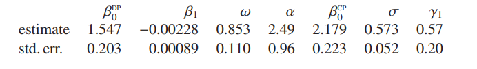

```{r setup, include=FALSE}
knitr::opts_chunk$set(echo = FALSE, warning = F,message = F)
library(tidyverse)
library(gridExtra)
library(CircStats)
library(sn)
```

<style>
body {
text-align: justify}
}
</style>

---
nocite: '@*'
...

## Contenido

- Introducción

- Modelo Skew Normal

- Modelo de regresión Skew Normal

- Aplicación

- Conclusiones

- Bibliográfica

# Introducción

## Antecedentes

<div class="columns-2">

Las V.A. son elementos fundamentales en la estadística, al estudiar su comportamiento se adaptan muy bien a funciones de probabilidad.

```{r fig.height=4,fig.width=5}
set.seed(1234)
x<-rnorm(10000,0,1)
y<-dnorm(x,0,1)
datos<-tibble(x,y)
datos %>% ggplot(aes(x,y))+
  geom_point(color="red")+
  geom_line(color="blue")
```

[@azzalini1985] define la función de densidad Skew-Normal, sus propiedades y estadísticos principales. 

[@azzalini2013], menciona que a partir de una función de densidad simétrica con modificaciones adecuadas genera un conjunto de distribuciones no simétricas y el objetivo es estudiar familias paramétricas flexibles de distribuciones continuas.

</div>

# Modelo Skew Normal

## Proposición

Sea $f_0$ una función de densidad de probabilidad en $\mathbb{R}^d$, sea $G_0(\cdot)$ una función de distribución continua en la recta real y sea $w(\cdot)$ una función de valor real en $\mathbb{R}^d$, tal que:

$$f_0(-x)=f_0(x),\hspace{1cm}w(-x)=-w(x),\hspace{1cm}G_0(-y)=1-G_0(y)$$ 
para todo $x\in\mathbb{R}^d, \;y\in\mathbb{R}$. 

Entonces

$$f(x)=2f_0(x)G_0\{w(x)\}$$

es una función de densidad en $\mathbb{R}^d$.

## Modelo Skew-Normal

Si $f_0=\varphi$ y $G_0=\Phi$ de una $N(0,1)$ y $w(x)=\alpha x$, con $\alpha \in \mathbb{R}$ parámetro de inclinación, se define

$$\varphi(x;\alpha)=2\varphi(x)\Phi(\alpha x)\hspace{1cm}(-\infty<x<\infty)$$

Se introduce un parámetro de escala $\omega$ y localización $\xi$. 

$$Y=\xi+\omega Z\hspace{1cm} (\xi\in\mathbb{R},\omega\in \mathbb{R}^+)$$

Así $Y\sim SN(\xi,\omega^2,\alpha)$ con $x\in \mathbb{R}$ es:

$$\frac{1}{\omega}\varphi\left(\frac{x-\xi}{\omega};\alpha\right)
\equiv\frac{2}{\omega}\varphi \left(\frac{x-\xi}{\omega}\right)\Phi\left(\alpha\frac{x-\xi}{\omega}\right)$$


*Observación.* Si $\xi=0$ y $\omega=1$ se vuelve a la definición básica de la Skew-Normal.


## Momentos

$$M_Y(t)=\mathbb{E}(e^{yt})=\mathbb{E}(exp\{(\xi+wz)t\})$$

 $$=2 exp\{\xi t+\frac{1}{2}\omega^2 t^2\} \Phi(\delta \omega t)$$

donde $\delta=\delta(\alpha)=\frac{\alpha}{\sqrt{1+\alpha^2}}$

Por la función generadora cumulante:

$$K_Y(t)=log\;M_Y(t)=\xi t+\frac{1}{2}\omega^2 t^2+\zeta_0(\delta\omega t)$$

donde $\zeta_0(x)=log\{2\Phi(x)\}$ y $\zeta_r(x)=\frac{d^r}{dx^r}\zeta_0(x)$ con $r=1,2,...$

## Momentos {.smaller}

$\forall \zeta_r(x)$ con $r>1$ pueden escribirse como funciones de $\zeta_1(x)$ y pontencias de $x$. Notar que $\zeta_1(x)>0$, $x+\zeta_1(x)>0$ y $\zeta_2(x)<0$.

Las derivadas de $K_Y(t)$ hasta el cuarto orden son:

$$\mathbb{E}\{Y\}=\xi+\omega \mu_z$$
$$Var\{Y\}=(\omega\sigma^2_z)^2$$
$$\mathbb{E}\{(Y-\mathbb{E}(Y))^3\}=\frac{1}{2}(4-\pi)(\omega \mu_z)^3$$

$$\mathbb{E}\{(Y-\mathbb{E}(Y))^4\}=2(\pi-3)(\omega \mu_z)^4$$


Donde $\mu_z=\mathbb{E}(Z)=b\delta$, $\sigma^2_z=Var(Z)=1-\mu^2_z=1-b^2\delta^2$ y $$b=\zeta_1(0)=\sqrt{\frac{2}{\pi}}$$


## Función log-verosimilitud

Sea $y$ un valor de la muestra de $Y\sim SN(\xi,\omega^2,\alpha)$

$$\ell_1(\theta^{DP};y)=ctte-log \omega - \frac{(y-\xi)^2}{2\omega^2}+\zeta_0\left(\alpha\frac{y-\xi}{\omega}\right)$$

$Y\sim SN(\xi,\omega^2,\alpha)$, $\theta^{DP}=(\xi,\omega,\alpha)^t$ y $\zeta_0(\cdot)$.

El componente del vector SCORE:

$$\frac{\partial \ell_1}{\partial \xi}=\frac{z}{\omega}-\frac{\alpha}{\omega}\zeta_1(\alpha z)$$
$$\frac{\partial \ell_1}{\partial \omega}=
-\frac{1}{\omega}+\frac{z^2}{\omega}-\frac{\alpha}{\omega}\zeta_1(\alpha z)z;\hspace{1cm}\frac{\partial \ell_1}{\partial \alpha}=\zeta_1(\alpha z)z $$

## Estimadores

Si se dispone de una muestra aleatoria $y_1,..., y_n$ de $Y \sim SN(\xi,\omega^2, \alpha)$

$$\sum_i z_i-\alpha\sum_i\zeta_1(\alpha z_i)=0$$
$$\sum_i z_i^2-\alpha\sum_i z_i\zeta_1(\alpha z_i)=n$$
$$\sum_i z_i\zeta_1(\alpha z_i)=0$$

Luego se tiene:

$$\hat\omega^2=\frac{1}{n}\sum_i (y_i-\hat\xi)^2$$


# Modelo de regresión Skew Normal

## Modelo de regresión Skew Normal

Para $\xi$, se expresará como una combinación lineal de un conjunto $p$-dimensional de covariables $x$

$$\xi=x^t\beta, \hspace{1cm}\beta\in\mathbb{R}^p$$

Entonces se tiene el modelo de regresión lineal dado por:

$$Y_i=x_i^t\beta+\varepsilon_i,\hspace{1cm}i=1,...,n$$

con $\varepsilon_i\sim^{iid} SN(0,\omega^2,\alpha)$, $\beta$ un vector de parámetros desconocidos. 


## Supuestos

Para este modelo se tiene los siguientes supuestos:

- Sea una muestra aleatoria independiente de $y=(y_1,...,y_n)^t$ con $n>p$.

- Matriz de diseño $X$ de dimensión $n\times p$ de rango $p$, donde la primera columna de $X$ es el vector $1_n$ (Multicolinealidad).

- Los residuos deben tener distribución Skew-Normal.

- Los residuos son independientes.

- Los residuos son homocedasticos.

## Estimación 

La expresión de la función del vector SCORE, será:

$$\frac{\partial \ell_1}{\partial\beta}=\left(\frac{z}{\omega}-\frac{\alpha}{\omega}\zeta_1(\alpha z)\right)x$$

Luego se tiene que del estimador:

$$\hat{\omega}^2=\frac{1}{n}\sum_{i} (y_i-\hat{\xi_i})^2;\hspace{1cm}\hat{\xi_i}=x_i^t\hat\beta;\;\; i=1,...,n$$

Cuando $\alpha=0$, la suma de términos del vector SCORE conduce a $\sum_{i}z_ix_i=0$, las ecuaciones son las del modelos lineal clásico.

## Matriz Hessiana {.smaller}

$-\frac{\partial^2\ell}{\partial\beta\partial\beta^t}=\omega^{-2}X^t(I_n+\alpha^2 Z_2 )X$


$-\frac{\partial^2\ell}{\partial\beta\partial\omega}=\omega^{-2}X^t(2z-\alpha \zeta_1(\alpha z)+\alpha^2 Z_2 z)$


$-\frac{\partial^2\ell}{\partial\beta\partial\alpha}=\omega^{-1}X^t(\alpha \zeta_1(\alpha z)-\alpha Z_2 z)$


$-\frac{\partial^2\ell}{\partial\omega^2}=\omega^{-2}(-n+3(1_n^t z^2)-2\alpha \zeta_1(\alpha z)^t z+\alpha^2 \zeta_2(\alpha z)^t z^2)$


$-\frac{\partial^2\ell}{\partial\omega \partial\alpha}=\omega^{-1}(\zeta_1(\alpha z)^t z+\alpha \zeta_2(\alpha z)^t z^2)$

$-\frac{\partial^2\ell}{\partial\alpha^2}=\zeta_2(\alpha z)^t z^2$

$$z=\frac{y-X\beta}{\omega}, \hspace{1cm}Z_2=diag(-\zeta_2(\alpha z))>0$$

## Matriz de información 

$$\mathcal{I}^{DP}(\theta^{DP}) =\begin{pmatrix}
 \frac{1+\alpha^2 a_0}{\omega^2}X^t X  &\cdot &\cdot\\
  \frac{1}{\omega}\left( \frac{b \alpha(1+2\alpha^2)}{(1+\alpha^2)^{3/2}}+\alpha^2 a_1 \right)1_n^tX & n\frac{2+\alpha^2a_2}{\omega^2} & \cdot\\ 
  \frac{1}{\omega}\left( \frac{b }{(1+\alpha^2)^{3/2}}-\alpha a_1 \right)1_n^tX & -n\frac{\alpha a_2}{\omega} & n a_2
\end{pmatrix}$$

con $\alpha=0$

$$\mathcal{I}^{DP}((\beta^t,\omega,0)^t) =
\begin{pmatrix}
 \frac{1}{\omega^2}X^t X  &\cdot &\cdot\\
  0 & \frac{2n}{\omega^2} & \cdot\\ 
  \frac{1}{\omega}b 1_n^tX & 0 & b^2n
\end{pmatrix}$$

$$det(\cdot)=0$$

## Parametrización centralizada

Para resolver el problema de singularidad cuando $\alpha=0$, la cual es:

$$Y=\mu+\sigma Z_0,\hspace{1cm} Z_0=\frac{Z-\mu_z}{\sigma_z}\sim SN\left(-\frac{\mu_z}{\sigma_z}, \frac{1}{\sigma_z^2},\alpha\right)$$

 $$\sigma^2=Var(Y)=(\omega \sigma_z)^2; \hspace{1cm}\sigma_z^2=Var(Z)=1-b^2\delta^2$$

 $$\mu_z=\mathbb{E}(Z)=b\delta$$


 $$b=\sqrt{2/\pi}$$

 $$\delta=\frac{\alpha}{\sqrt{1+\alpha^2}}$$

con $\theta^{CP}=(\mu, \sigma, \gamma_1)^t$, *parámetros centrados*

## Parámetrización centralizada

$$\mu=\xi+b\omega\frac{\alpha}{\sqrt{1+\alpha^2}}=\xi+b\omega\delta(\alpha)$$
$$\sigma=\omega(1-b^2 \delta(\alpha)^2)^{1/2}$$

$$\gamma_1=\frac{4-\pi}{2}\frac{b^3\delta(\alpha)^3}{[1-b^2\delta(\alpha)^2]^{3/2}}=\frac{4-\pi}{2}\frac{b^3\alpha^3}{[1+(1-b^2)\alpha^2]^{3/2}}$$

$$\omega=\frac{\delta}{(1-b^2\delta(\alpha)^2)^{1/2}}$$ 

$$\xi=\mu-b\omega\delta(\alpha)$$


## Distribución asintótica de MLE

Por (Rotnitzky et al., 2000), los $CP$ se comporta regularmente en el punto $\gamma_1 = 0$, de dos maneras: 

(a) el perfil log-verosimilitud de $\gamma_1$ no tiene ningún punto estacionario en $\gamma_1 = 0$

(b) si $\theta^{CP}=(\mu,\sigma,0)$, entonces

$$\sqrt{n}(\hat\theta^{CP}-\theta^{CP})\xrightarrow{d}N_3\left(0,diag(\sigma^2,\frac{1}{2}\sigma^2,6)\right)$$

## Residuos normalizados

Los residuos de la regresión estan dados por:

$$\hat z_i=\frac{(y_i-\hat\xi)}{\hat\omega};\hspace{1cm}i=1,...,n$$

tal que $z_i$ debe ser muestreada aproximadamente como una distribución $\chi^2_1$, recordando que:

$$Z^2=\frac{(Y-\xi)^2}{\omega^2}\sim \chi^2_1$$


## Modelo ajustado

Pot lo visto anteriormente se tiene el modelo de regresión lineal estimado y ajustado tomando en cuenta los parámetros $CP$ y esta dado por:

$$\hat{Y_i}=x_i^t\hat{\beta}+\frac{b\delta}{\sqrt{1-b^2\delta^2}},\hspace{1cm}i=1,...,n$$

con $\varepsilon_i\sim^{iid} SN(0,\sigma^2,\gamma_1)$ $iid$, $\beta$ 


# Aplicación

## Datos


Se utiliza la base de datos que esta en R `data(wines)` de la librería `sn` que hace referencia a tres cultivos (Barolo, Barbera y Grignolino) de la región de Piedmont de Italia, que contiene $178$ diferentes vinos italianos con $59$, $48$ y $71$ datos respectivamente y se recogieron $28$ medidas químicas de cada clase de vino.

## Primer modelo

Del cultivo Barolo y la variable fenoles (phenols) que será nuestra variable de respuesta.

```{r fig.height=4}
data(wines)
barolo_phenols <- wines[wines$wine=="Barolo", "phenols"]
hist(barolo_phenols,main="Fenoles del cultivo Barolo")
```

```{r }
fit <- lm(barolo_phenols ~ 1)
fit_sn <- selm(barolo_phenols ~ 1, family="SN")
```

## QQ-plot residuos

Ahora vemos el comportamiento que tiene sus residuos al cuadrado con el qq-plot.

```{r fig.height=4}
res<-(barolo_phenols-fit$fitted.values)/0.339

xi<-coef(fit_sn,param.type="DP")[1]
omega<-coef(fit_sn,param.type="DP")[2]
res_sn<-(barolo_phenols-xi)/omega
p<-(1:59)/60

par(mfrow=c(1,2))
qqplot(qchisq(p,1),res^2,ylim = c(0,10),main = "QQ-Plot residuos Normales")
qqline(res_sn^2,distribution = function(p) qchisq(p, df = 1),probs = c(0.215, 0.5), col = 2)
qqplot(qchisq(p,1),res_sn^2,ylim = c(0,10),main = "QQ-Plot residuos SN")
qqline(res_sn^2,distribution = function(p) qchisq(p, df = 1),probs = c(0.215, 0.5), col = 2)
```

## Histogramas de residuos


```{r fig.height=4}
par(mfrow=c(1,2))
hist(res,main = "Residuos Normales")
hist(res_sn ,main = "Residuos SN")
```

## Segundo Modelo

Del cultivo Grifnolino y la variable proantocianinas (proanthocyanins) que será nuestra variable de respuesta y se la covariable será nitrogeno (nitrogen)

```{r}
vinos<-tibble(cultivo=wines$wine,nitrogeno=wines$nitrogen,proantocianinas=wines$proanthocyanins)
vinos<-vinos %>% filter(vinos=="Grignolino")
mod<-lm(proantocianinas~nitrogeno,data = vinos)
mod_sn<-selm(proantocianinas~nitrogeno,data = vinos,family = "SN")

```


```{r}
omega_dp<-coef(mod_sn,param.type="DP")[3]

sigma_cp<-coef(mod_sn,param.type="CP")[3]

base<-vinos %>% 
  mutate(fit_lm=fitted(mod),
         SN_DP=fitted.selm(mod_sn,param.type = "DP"),
         SN_CP=fitted.selm(mod_sn,param.type = "CP"),
         res_lm=(proantocianinas-fit_lm)/0.5895,
         res_DP=(proantocianinas-SN_DP)/omega_dp,
         res_CP=(proantocianinas-SN_DP)/sigma_cp,
         res2_lm=res_lm^2,
         res2_DP=res_DP^2,
         res2_CP=res_CP^2,
         p=(1:nrow(.))/72,
         chi2=qchisq(p,1))
```


```{r fig.height=4}
base %>% 
  ggplot(aes(nitrogeno,proantocianinas))+
  geom_point()+
  geom_line(aes(nitrogeno,fit_lm,color="MC"))+
  geom_line(aes(nitrogeno,SN_DP,color="SN/DP"))+
  geom_line(aes(nitrogeno,SN_CP,color="SN/CP"))
```

## QQ-plot de Residuos

```{r fig.height=5,fig.widt=8}
par(mfrow=c(1,2))
qqplot(base$chi2,base$res2_lm,ylim=c(0,11),main="QQ-plot Modelo Normal")
qqline(base$res2_CP,distribution = function(p) qchisq(p, df = 1),probs = c(0.215, 0.5), col = 2)
qqplot(base$chi2,base$res2_DP,ylim=c(0,11),main="QQ-plot Modelo SN-DP")
qqline(base$res2_CP,distribution = function(p) qchisq(p, df = 1),probs = c(0.215, 0.5), col = 2)
```

## QQ-plot de Residuos

```{r fig.height=5,fig.widt=6}
par(mfrow=c(1,2))
qqplot(base$chi2,base$res2_lm,ylim=c(0,11),main="QQ-plot Modelo Normal")
qqline(base$res2_CP,distribution = function(p) qchisq(p, df = 1),probs = c(0.215, 0.5), col = 2)
qqplot(base$chi2,base$res2_CP,ylim=c(0,11),main="QQ-plot Modelo SN-CP")
qqline(base$res2_CP,distribution = function(p) qchisq(p, df = 1),probs = c(0.215, 0.5), col = 2)
```

## PP-Plot de residuos

El de la izquiera es del modelo de  regresión normal y la derecha el modelo SN-DP

```{r fig.height=3,fig.widt=6}
par(mfrow=c(1,2))
pp.plot(base$res2_lm,ref.line = F)
pp.plot(base$res2_CP,ref.line = F)
```

## PP-Plot de residuos

El de la izquiera es del modelo de  regresión normal y la derecha el modelo SN-CP

```{r fig.height=3,fig.widt=6}
par(mfrow=c(1,2))
pp.plot(base$res2_lm,ref.line = F)
pp.plot(base$res2_DP,ref.line = F)
```

## Estimadores

{width='700px'}

# Conclusiones


## Conclusiones {.build}

<div>
- Se hizo una revisión bibliográfica de la distribuciones asimétricas (Skew), encontrando así diferentes investigaciones de diferentes autores, donde el principal precursor y creador es Azzalini, el cual desde 1985 presentó esta nueva familia de distribuciones asimétricas.
</div>
<div>
- Al insertar un parámetro de inclinación la distribución se vuelve asimétrica y posteriormente se incrementa un parámetro de escala y localización que hace más flexible la distribución.
</div>
<div>
- Se pudo conocer la teoría de los modelos de regresión skew-normal y sus implicando con parametros $DP$ y $CP$.
</div>

<div>
- Se pudo comparar tres modelos de regresión lineal, el primero modelo lineal general, luego un modelo lineal skew-normal con parámetros $CP$ y el otro con parámetros $DP$ encontrando así un mejor ajuste a los datos con el modelo Skew-Normal con parámetros de estimación $DP$
</div>

# Bibliografía

## Bibliografía


